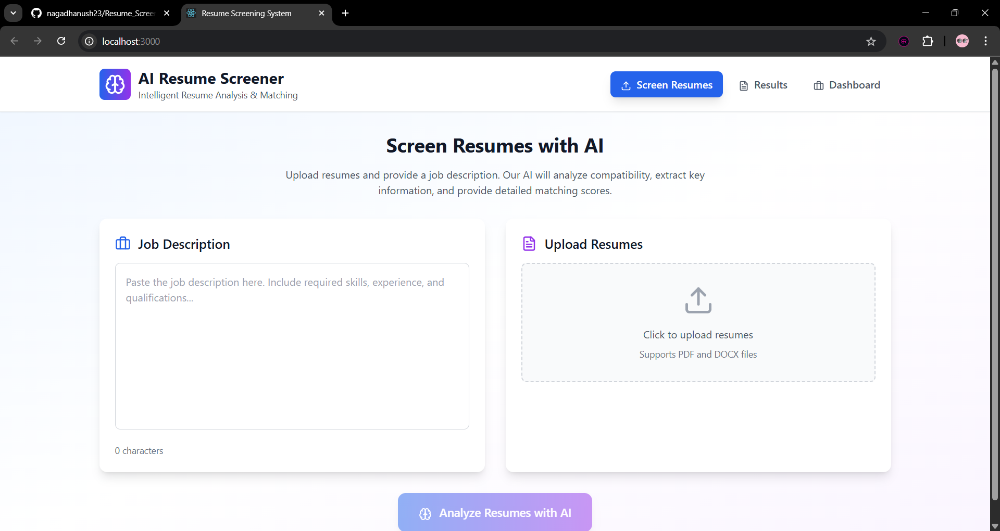
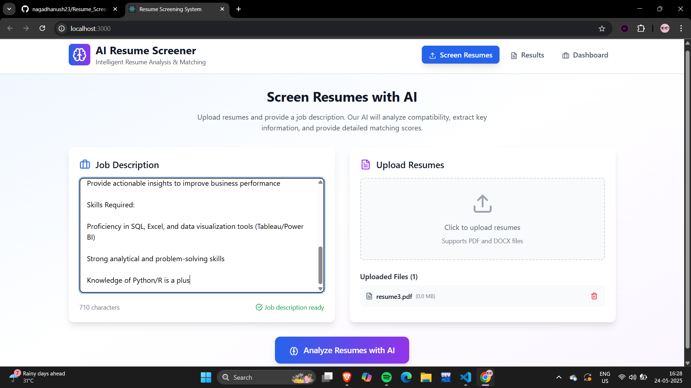
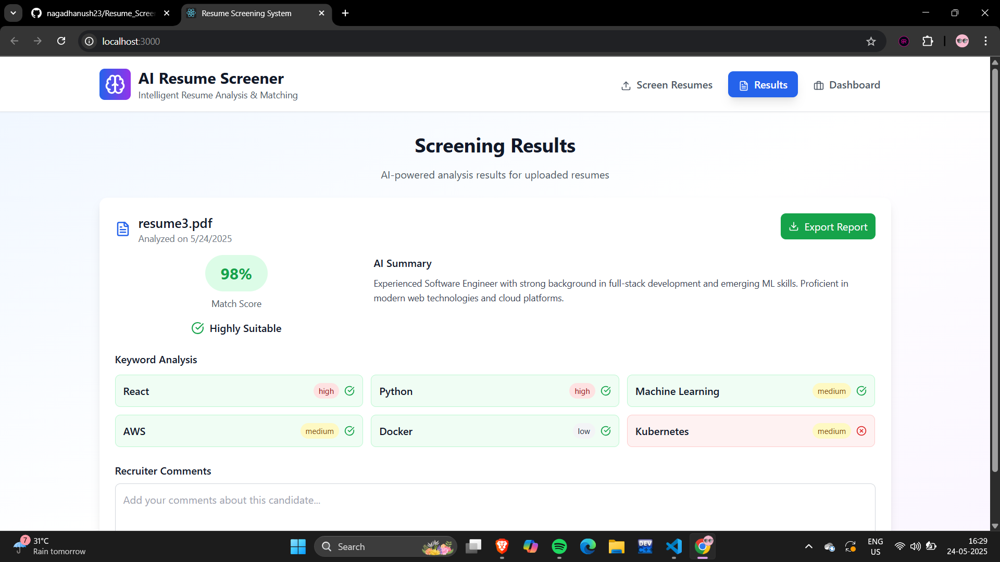
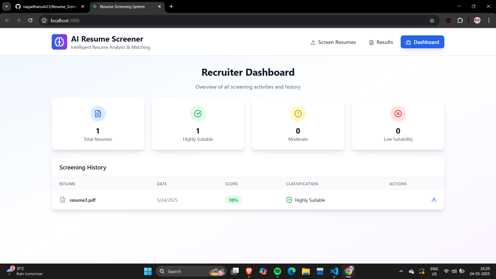

# 📊 AI Resume Screening System

A comprehensive full-stack application that uses artificial intelligence to analyze and match resumes against job descriptions. Built with React.js and designed for recruiters and HR professionals to streamline their hiring process.

  

## 🎯 Features

### Core Functionality
- **📄 Multi-Format Resume Upload** - Support for PDF and DOCX files
- **🤖 AI-Powered Analysis** - Intelligent resume parsing and job matching
- **📊 Match Scoring** - Percentage-based compatibility scoring (60-100%)
- **🔍 Keyword Analysis** - Detailed keyword matching with importance levels
- **📈 Classification System** - Automatic categorization (Highly Suitable/Moderate/Low)
- **💬 Recruiter Comments** - Add notes and feedback for each candidate

### Dashboard & Reports
- **📋 Recruiter Dashboard** - Comprehensive overview of all screening activities
- **📊 Statistics Overview** - Visual stats for processed resumes
- **📥 Export Reports** - Download detailed PDF reports
- **🕒 Screening History** - Complete audit trail of all analyses
- **🎨 Modern UI/UX** - Professional, responsive design

### Advanced Features
- **🔤 Text Extraction** - Automated content extraction from documents
- **🧠 NLP Processing** - Natural Language Processing for semantic analysis
- **⚡ Real-time Processing** - Live progress indicators
- **📱 Responsive Design** - Works on desktop, tablet, and mobile

## 🛠️ Tech Stack

### Frontend
- **React.js 18.2.0** - Modern JavaScript framework
- **Tailwind CSS** - Utility-first CSS framework
- **Lucide React** - Beautiful icon library
- **JavaScript ES6+** - Modern JavaScript features

### Planned Backend (Full Implementation)
- **Python FastAPI** - High-performance API framework
- **BERT/Transformers** - Advanced NLP models
- **scikit-learn** - Machine learning algorithms
- **spaCy/NLTK** - Text processing libraries
- **MongoDB/PostgreSQL** - Database for data persistence

### Project samples (Full Implementation)








## 🚀 Quick Start

### Prerequisites
- **Node.js** (v16 or higher)
- **npm** or **yarn**
- Modern web browser

### Installation

1. **Clone the repository**
   ```bash
   git clone https://github.com/yourusername/resume-screening-system.git
   cd resume-screening-system
   ```

2. **Install dependencies**
   ```bash
   npm install
   ```

3. **Install required packages**
   ```bash
   npm install lucide-react
   ```

4. **Set up Tailwind CSS (Method 1 - Local)**
   ```bash
   npm install -D tailwindcss postcss autoprefixer
   npx tailwindcss init -p
   ```

   Update `tailwind.config.js`:
   ```javascript
   module.exports = {
     content: ["./src/**/*.{js,jsx,ts,tsx}"],
     theme: { extend: {} },
     plugins: [],
   }
   ```

   Update `src/index.css`:
   ```css
   @tailwind base;
   @tailwind components;
   @tailwind utilities;
   ```

5. **Alternative: Use Tailwind CDN (Method 2 - Recommended)**
   
   Add to `public/index.html`:
   ```html
   <script src="https://cdn.tailwindcss.com"></script>
   ```

   Update `src/index.css`:
   ```css
   body {
     margin: 0;
     font-family: -apple-system, BlinkMacSystemFont, 'Segoe UI', sans-serif;
   }
   ```

6. **Start the development server**
   ```bash
   npm start
   ```

7. **Open your browser**
   Navigate to `http://localhost:3000`

## 📁 Project Structure

```
resume-screening-system/
├── public/
│   ├── index.html          # Main HTML template
│   ├── favicon.ico         # App icon
│   └── manifest.json       # PWA manifest
├── src/
│   ├── App.js              # Main application component
│   ├── index.js            # React DOM rendering
│   ├── index.css           # Global styles
│   └── App.css             # Component styles (optional)
├── package.json            # Dependencies and scripts
├── tailwind.config.js      # Tailwind configuration
├── postcss.config.js       # PostCSS configuration
└── README.md              # This file
```

## 🎮 Usage Guide

### 1. Upload Resumes
- Navigate to the "Screen Resumes" tab
- Click the upload area or drag & drop PDF/DOCX files
- Multiple files can be uploaded simultaneously

### 2. Add Job Description
- Enter the complete job description in the text area
- Include required skills, experience, and qualifications
- The system will use this for matching analysis

### 3. Run Analysis
- Click "Analyze Resumes with AI" button
- Wait for processing (simulated 2-second delay)
- Results will appear automatically

### 4. Review Results
- View match scores (60-100%)
- Check classification categories
- Analyze keyword matching
- Add recruiter comments

### 5. Export Reports
- Click "Export Report" for detailed PDF downloads
- Access screening history in Dashboard tab
- View comprehensive statistics

## 🔧 Configuration

### Environment Variables
Create a `.env` file in the root directory:
```env
REACT_APP_API_URL=http://localhost:8000
REACT_APP_VERSION=1.0.0
REACT_APP_ENVIRONMENT=development
```

### Customization Options
- **Scoring Algorithm**: Modify `processResume` function in `App.js`
- **UI Themes**: Update Tailwind classes or add custom CSS
- **File Types**: Extend `accept` attribute in file input
- **Keywords**: Customize keyword lists in mock data

## 🚀 Deployment

### Build for Production
```bash
npm run build
```

### Deploy to Vercel
```bash
npm install -g vercel
vercel --prod
```

### Deploy to Netlify
```bash
npm run build
# Upload dist folder to Netlify
```

### Deploy to GitHub Pages
```bash
npm install --save-dev gh-pages
npm run build
npm run deploy
```

## 🔮 Future Enhancements

### Backend Integration
- [ ] Python FastAPI backend implementation
- [ ] Real PDF/DOCX text extraction
- [ ] BERT embeddings for semantic analysis
- [ ] Database integration (MongoDB/PostgreSQL)
- [ ] User authentication system

### Advanced Features
- [ ] Bulk resume processing
- [ ] Advanced filtering and search
- [ ] Email integration for candidate outreach
- [ ] Interview scheduling integration
- [ ] Custom scoring algorithms
- [ ] Multi-language support

### AI Improvements
- [ ] Fine-tuned BERT models
- [ ] Custom NLP pipelines
- [ ] Bias detection and mitigation
- [ ] Skill extraction and categorization
- [ ] Experience level assessment

## 🐛 Troubleshooting

### Common Issues

1. **Tailwind CSS not working**
   ```bash
   # Use CDN approach
   # Add <script src="https://cdn.tailwindcss.com"></script> to index.html
   ```

2. **Icons not displaying**
   ```bash
   npm install lucide-react
   # Restart development server
   ```

3. **Build errors**
   ```bash
   # Clear node_modules and reinstall
   rm -rf node_modules package-lock.json
   npm install
   ```

4. **PostCSS errors**
   ```bash
   # Remove PostCSS config and use CDN
   rm postcss.config.js tailwind.config.js
   ```

### Performance Optimization
- Implement lazy loading for large file lists
- Add file size limits and validation
- Optimize bundle size with code splitting
- Add service worker for offline capability

## 📝 API Documentation

### Mock API Endpoints (Frontend Only)
Currently, the application uses mock data. For full backend implementation:

```javascript
// POST /api/upload-resume
// POST /api/analyze
// GET /api/history
// POST /api/export-report
// GET /api/statistics
```

## 🤝 Contributing

1. Fork the repository
2. Create a feature branch (`git checkout -b feature/amazing-feature`)
3. Commit your changes (`git commit -m 'Add amazing feature'`)
4. Push to the branch (`git push origin feature/amazing-feature`)
5. Open a Pull Request

### Development Guidelines
- Follow React best practices
- Use meaningful variable names
- Add comments for complex logic
- Test on multiple browsers
- Maintain responsive design

## 📄 License

This project is licensed under the MIT License - see the [LICENSE](LICENSE) file for details.

## 🙏 Acknowledgments

- **React Team** - For the amazing framework
- **Tailwind CSS** - For beautiful styling utilities
- **Lucide** - For the comprehensive icon library
- **Open Source Community** - For inspiration and resources


*Transform your hiring process with AI-powered resume screening!*